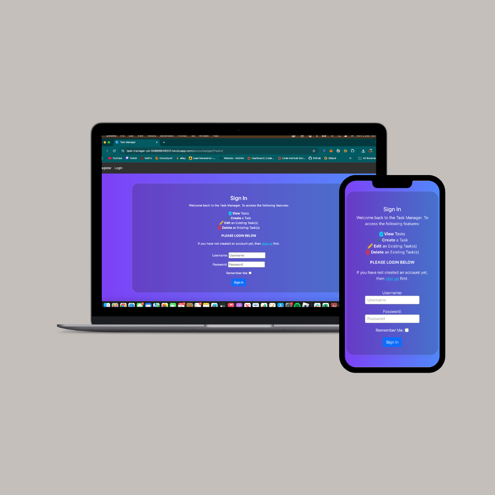
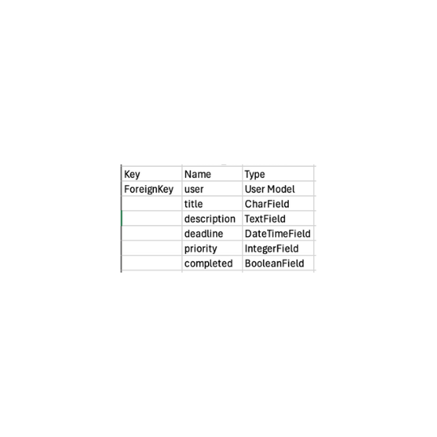
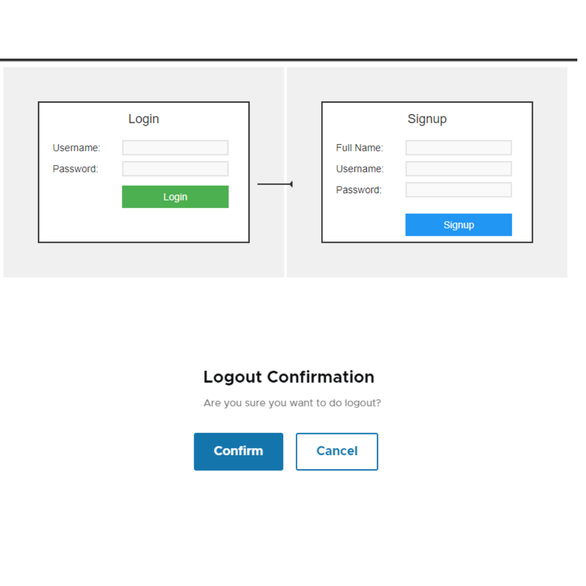
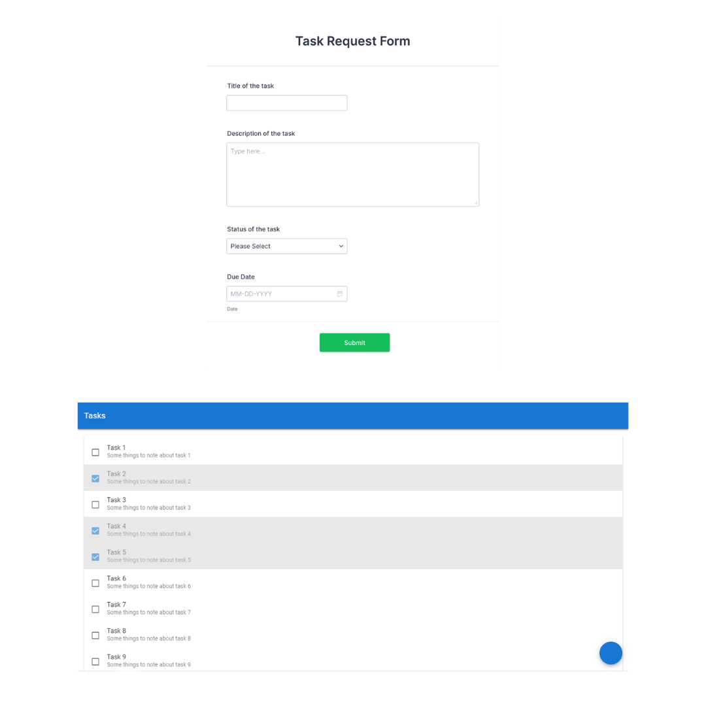

# Task Manager

Task Manager is a full-stack, responsive website built with an incentive to get people to become more productive. This website is for educational purposes only!

The website consists of a default Task Manager page where users gain full accessibility to the features when logged in. If not logged in, users are redirected to the login/ signup pages before gaining access the the site.

[Click here](https://task-manager-p4-948686f46531.herokuapp.com/) to go to the Task Manager's Live Wesbite.



## Table of Contents

- [Overview](#overview)
- [Agile Methodology](#agile-methodology)
- [User Experience (UX)](#user-experience-ux)
  - [Strategy / Site Goals](#strategy--site-goals)
  - [Scope / User Stories](#scope--user-stories)
  - [Structure / Design Choices](#structure--design-choices)
  - [Skeleton / Wireframes](#skeleton--wireframes)
- [Features](#features)
  - [Existing Features](#existing-features)
  - [Future Features](#future-features)
- [Technologies Used](#technologies-used)
- [Testing](#testing)
- [Bugs](#bugs)
- [Deployment](#deployment)
  - [Forking the GitHub Repository](#forking-the-github-repository)
  - [Creating a Local Clone](#creating-a-local-clone)
- [Credits](#credits)
- [Acknowledgements](#acknowledgements)

[Back To Top](#Task-Manager)

---

## Overview

Task Manager is a responsive website, prioritising mobile users. It is compatible with all current major browsers. The website is built for educational purposes, using Bootstrap and the Django framework.

It gives users the ability to complete simple variations of registration (login/signup) and includes full CRUD functionality.

[Back To Top](#table-of-contents)

---

## Agile Methodology

The plan for this project was carried out using Agile Methodology. GitHub Issues, which can be viewed [here](https://github.com/JackSummerfield1/task-manager-p4/issues?q=is%3Aissue+is%3Aclosed), were used to recored the User Stories.

Each User Story contains Acceptance Criteria which I sometimes had to change after I did the process as it didn't meet the criteria I initially aimed for.

[Here](https://github.com/users/JackSummerfield1/projects/3) is also a link to my KanBan board.

[Back To Top](#Task-Manager)

---

## User Experience (UX)

### Strategy / Site Goals

This Task Manager Website provides a secure and efficient platform for users to manage their tasks. The website allows logged-in users to perform CRUD (Create, Read, Update, Delete) operations on their tasks. User authentication ensures data privacy, and the platform supports role-specific functionalities for users, administrators, and developers.

---

### Scope / User Stories

**As an admin**

- I can manager user accounts so that I can maintain the system's integrity.

- I can monitor user tasks so that I can audit and provide support when needed.

**As a user**

- I can log in to the task manager so that I can securely access my tasks.

- I can view my list of tasks so that I can keep track of what needs to be completed.

- I can create, edit, and delete tasks so that I can manage my workload.

- I can log out of the system so that I can ensure security of my account and all of my tasks will be saved.

**As a developer**

- I can implement new features so that the system stays up-to-date and meets user needs.

- I can debug and maintain the codebase so that the platform runs quickly and efficiently.

### Structure / Design Choices

The website is simple and consistent with its structure. Its structure was designed to be responsive for most devices.

The Navigation menu displays Login Register options if a user is not logged in and the Logout option when logged in. This ensures access control and security is guaranteed and users can only access features once logged in.

The Task List Page clearly provides a list of all the tasks associated with that user. The Add, Edit and Delete options are all clear on how to use.

Confirmation messages are provided to the user when completing something. E.g. signing out, creating a task, editing a task, deleting a task etc. Ensuring the user of every option they choose to do.

Only one custom model has been implemented into this project.

**The Task Model** - User to Task: One-to-Many (A user can create multiple tasks):

**ERD Diagram of the Task Model:**



---

### Skeleton / Wireframes

Wireframes were first sketched on paper and then found some ones that were more appropriate for the structure I wanted to go with.

**Registration Wireframes**



**Task-CRUD-Wireframes**



[Back To Top](#Task-Manager)

## Features

### Existing Features

**User Authentication:**

- Secure user login and logout functionality.
  Ensures tasks are only accessible to their respective users.

**Task Management:**

- Create, view, update, and delete tasks easily.
- Each task includes details like title, description, deadline, priority, and completion status.

**Priority Levels:**

- Assign tasks a priority level (Low, Medium, High) to manage workload effectively.

**Completion Tracking:**

- Mark tasks as completed to stay organized and track progress.

**Deadlines:**

- Optional deadlines to help users manage time-sensitive tasks.

**Personalized Task Lists:**

- Users can view a filtered list of tasks specific to their account.

**Responsive Notifications:**

- Success messages after creating, updating, or deleting tasks provide instant feedback.

**Mobile-Friendly Design:**

- Optimized for use on mobile and desktop devices, ensuring accessibility on the go.

**Confirmation for Deletions:**

- A confirmation page ensures users don't accidentally delete tasks.

**Secure Data Management:**

- Tasks are tied to individual user accounts, preventing unauthorized access.

### Future Features

**Searching for Tasks**

- Tasks can be filtered by keywords in the title of tasks so that users can locate them more easily when they have a large list.

[Back To Top](#Task-Manager)

## Technologies Used

- Frontend:

**HTML5:** For creating the structure and layout of web pages.
**CSS3:** For styling and enhancing the visual appeal of the application.
**Bootstrap:** A responsive CSS framework for building mobile-friendly and modern user interfaces.

- Backend:

**Python:** The primary programming language for backend logic.
**Django:** A high-level Python web framework used for rapid development and clean, pragmatic design.

- Database:

**PostgreSQL:** A lightweight and default database provided by Django for local development.

- Authentication:

**Django’s Built-in Authentication System:** For secure user login, logout, and user-specific task management.

- Messaging:

**Django Messages Framework:** For displaying success, error, and confirmation messages to users.

- Development Tools:

**Django ORM:** For database queries and data management.
**Gitpod** An IDE for writing, running and testing my code directly ot the browser.

- Testing:

**Django Test Framework:** For writing unit tests to ensure application reliability and correctness.

- Version Control:

**Git:** For tracking changes and collaborating during development.
**GitHub:** For storing and sharing the project repository.

- OTHER:

**ChatGPT** For debugging code and assisting with writing tests.

## Testing

All of my testing is in my TESTING.md file

---

## Deployment

For good practice, this project was deployed early to [Heroku](https://www.heroku.com) in order to save time and avoid nasty surprises later on.

After installing Django and the supporting libraries, the basic Django project was created and migrated to the database.

In order for Heroku to be able to access the database, a new database suitable for production needs to be created. Heroku offers a postgres add-on at an extra charge. I am using a postgreSQL database instance hosted on [CI Database](https://dbs.ci-dbs.net/) as this service is free.

<details>
<summary>Steps taken before deploying the project to Heroku</summary>

### Create the Heroku App

1. Login to Heroku and click on the top right button ‘New’ on the dashboard.
2. Click ‘Create new app’.
3. Give your app a unique name and select the region closest to you.
4. Click on the ‘Create app’ button.

### Create the PostgreSQL Database

1. Login to https://dbs.ci-dbs.net/.
2. step 1: enter your email address and submit.
3. step 2: creates a database.
4. step 3: receive the database link on your email id.

### Create the env.py file

With the database created, it now needs to be connected with the project. Certain variables need to be kept private and should not be published to GitHub.

1. In order to keep these variables hidden, it is important to create an env.py file and add it to .gitignore.
2. At the top **import os** and set the DATABASE_URL variable using the `os.environ` method. Add the URL copied from instance created above to it, like so:
   `os.environ[“DATABASE_URL”] = ”copiedURL”`
3. The Django application requires a SECRET_KEY to encrypt session cookies. Set this variable to any string you like.

### Modify settings.py

It is important to make the Django project aware of the env.py file and to connect the workspace to the new database.

1. Open up the settings.py file and add the following code. The if statement acts as a safety net for the application in case it is run without the env.py file.

```
import os
import dj_database_url

if os.path.isfile(‘env.py’):
    import env
```

2. Remove the insecure secret key provided by Django and reference the variable set in the env.py file earlier, like so:

```
SECRET_KEY = os.environ.get(‘SECRET_KEY’)
```

3. Hook up the database using the dj_database_url import added above. The original DATABASES variable provided by Django connects the Django application to the created db.sqlite3 database within your repo. This database is not suitable for production so comment out the existing db.sqlite3 and include the command as below for the new database.

```
# Database
# https://docs.djangoproject.com/en/5.0/ref/settings/#databases

# DATABASES = {
#   'default': {
#       'ENGINE': 'django.db.backends.sqlite3',
#       'NAME': BASE_DIR / 'db.sqlite3',
#   }
# }

DATABASES = {
    'default': dj_database_url.parse(os.environ.get("DATABASE_URL"))
}
```

**NOTE**: If at the start of the development you are using the local db.sqlite3, make sure to add it to the .gitignore file, so as not to make the mistake of pushing it to your repository.

5. Save and migrate this database structure to the newly connected postgreSQL database. Run the migrate command in your terminal
   `python3 manage.py migrate`

### Connect the Database to Heroku

1. Open up the Heroku dashboard, select the project’s app and click on the ‘Settings’ tab.
2. Click on ‘Reveal Config Vars’ and add the DATABASE_URL with the value of the copied URL from the database instance created on CI database.
3. Also add the SECRET_KEY with the value of the secret key added to the env.py file.
4. If using gitpod another key needs to be added in order for the deployment to succeed. This is PORT with the value of 8000.

### Setup the Templates Directory

In settings.py, add the following under BASE_DIR
`DIRS = os.path.join(BASE_DIR, "templates")`

### Add the Heroku Host Name

In settings.py scroll to ALLOWED_HOSTS and add the Heroku host name. This should be the Heroku app name created earlier followed by `.herokuapp.com`. Add in `’localhost’` so that it can be run locally.

```
ALLOWED_HOSTS = [‘heroku-app-name.herokuapp.com’, ‘localhost’]
```

### Create the Directories and the Process File

1. Create the media, static and templates directories at the top level next to the manage.py file.
2. At the same level create a new file called ‘Procfile’ with a capital ‘P’. This tells Heroku how to run this project.
3. Add the following code, including the name of your project directory.

```
web: gunicorn task_manager.wsgi
```

- ‘web’ tells Heroku that this a process that should accept HTTP traffic.
- ‘gunicorn’ is the server used.
- ‘wsgi’, stands for web services gateway interface and is a standard that allows Python services to integrate with web servers.

4. Save everything and push to GitHub.

</details>

<details>
<summary>First Deployment</summary>

### First Deployment

1. Go back to the Heroku dashboard and click on the ‘Deploy’ tab.
2. For deployment method, select ‘GitHub’ and search for the project’s repository from the list.
3. Select and then click on ‘Deploy Branch’.
4. When the build log is complete it should say that the app has been successfully deployed.
5. Click on the ‘Open App’ button to view it and the Django “The install worked successfully!” page, should be displayed.

</details>

<details>
<summary>Final Deployment</summary>

### Final Deployment

1. When development is complete, if you had left `DEBUG = True` in the settings.py file, make sure to change it to `False`. You don't have to change anything if you had used `DEBUG = 'DEVELOPMENT' in os.environ` as your env.py file is ignored by GitHub.
2. Commit and push your code to your project's repository.
3. Then open up Heroku, navigate to your project's app. Click on the 'settings' tab, open up the config vars and delete the DISABLE_COLLECTSTATIC variable.
4. Navigate to the 'Deploy' tab and scroll down to 'Deploy a GitHub branch'.
5. Select the branch you want to deploy and click on the 'Deploy branch' button. When the app is deployed, you should see a message in the built log saying "Your app was successfully deployed". Click 'View' to see the deployed app in the browser. Alternatively, you can click on the 'Open App' button at the top of the page.

</details>

---

### Forking the GitHub Repository

<details>
<summary>Steps to Fork the GitHub Repository</summary>

Forking allows you to view and edit the code without affecting the original repository

1. Locate the GitHub repository. Link to this repository can be found [here](https://github.com/JackSummerfield1/task-manager-p4/).
2. Click on 'Fork', in the top right-hand corner.
3. This will take you to your own repository to a fork with the same name as the original branch.

</details>

---

### Creating a Local Clone

<details>
<summary>Steps to Creating a Local Clone</summary>

1. Go to the GitHub repository. Link to this repository can be found [here](https://github.com/JackSummerfield1/task-manager-p4/).
2. Click on 'Code' to the right of the screen. This will open a dropdown. Click on HTTPs and copy the link.
3. Open Git Bash in your IDE and change the current working directory to the location where you want the cloned directory.
4. Type `git clone`, paste the URL you copied earlier, and press Enter to create your local clone.

More information on Creating and Managing repositories can be found [here](https://docs.github.com/en/repositories/creating-and-managing-repositories/cloning-a-repository)
<br>

</details>

[Back To Top](#table-of-contents)
