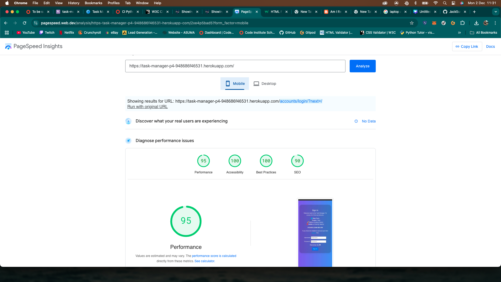

# Testing

I have completed a series of manual and automated tests to:

- Ensure core functionalities like task creation, editing, and deletion work correctly.
- Validate user interactions with forms, views, and the overall user interface.
- Test the application's response to edge cases and invalid inputs.
- Maintain a high level of code quality and minimizing potential bugs.

## Table of Contents

- [Automated-Testing](#automated-testing)
- [Manual-Testing]

[Back To Top](#Testing)

## Automated Testing

I have completed a series of methods in my test_forms.py and test_views.py to validate both my form and views are working as expected. As shown in the screenshot below, the application ran into no issues with these tests:

[Back To Top](#Testing)

## Manual Testing

### Lighthouse Performance

Everything all green on the LH test, specifically accessibility being 100%.

### HTML5 Validator

I did run into a couple of unresolved issues on the task_delete.html page and also the task_form.html template as I ran out of time before submission to fix these errors. However, all other pages are working with no warnings or errors as shown below:

### CSS3 Validator

All CSS code was valid:

### CI Python Linter

There were a few issues with lines too long and trailing whitespaces on some of the python files but those issues have been rectified.

## Manual Testing

1. Cross-Browser Testing
   To ensure the task manager works across major browsers, I have:

   - Opened the task manager in Chrome.
   - Tested the core features (e.g., adding, editing, deleting tasks).
   - Repeat those steps for Firefox, Safari, and Edge.
   - Verified that the UI, functionality, and performance are consistent across all browsers.

2. Cross-Device Testing
   To ensure that the task manager is responsive and functional on different screen sizes (desktop, tablet, mobile).
   I have opened the task manager on a desktop screen, resized the browser window to various sizes (e.g., tablet, mobile).
   And have verified that all elements scale and adjust properly, also testing interactions like adding tasks and navigating through screens on a tablet and mobile devices.
